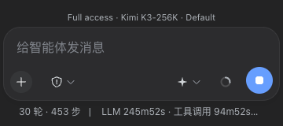
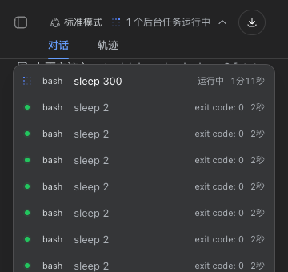

# dsh-mobile-webui

**English** | [中文](README.md)

Fixes mobile-viewport usability problems in the dsh web GUI. Client plugin,
pure browser-side, no build step.

## Demo (real 360px dark-mode screenshots)

| Icon-only composer + status line | Centered background-tasks popover |
|---|---|
|  |  |

## What it fixes

Mobile-viewport fixes for the dsh web GUI as a client plugin: full-width chat
with an overlay drawer sidebar, swipe gestures, safe-area/dvh composer,
code-block horizontal scrolling, 44px touch targets, and an icon-only
composer row with a small mode · model · effort status line above the card.
Pure browser-side, no build step, zero effect on desktop widths.

Nine layout-layer rules additionally apply: ①≤768px hides fullscreen
background layers injected by other plugins (`.dsh-viz-canvas` /
`.dsh-viz-scrim` / `.dsh-viz-root`; no-ops when absent) and restores an opaque
page background — readability and battery come first on phones; ②≤768px
popover re-anchoring: composer popovers (model/effort picker, permission
modes) get `position: static` anchors so menus clamp inside the composer
card; header popovers (background-task list etc.) re-anchor to the
full-width session-header slot and center horizontally — the native small
anchor + `left:0`/`right:0` pushes a 328px menu off-screen at ~360 CSS px
(measured: the tasks popover overflowed by 106px); ③≤768px the session-log
download button loses its text label and its `min-width: 111px`, shrinking
to a 34px icon; ④≤768px swipe gestures: a clearly-horizontal right swipe
opens the sidebar drawer, left swipe closes it (fires mid-gesture past a
64px threshold; vertical scrolling and horizontal scrolling inside code
blocks/tables are never hijacked; all listeners passive); ⑤≤768px icon-only
composer row: the model switcher hides its text and effort badge and gains
an injected neutral four-point-star icon (the native trigger is
text+badge+chevron only, so pure icon-ification must supply a recognizable
glyph; the permission-mode button already goes icon-only via an app rule),
while an 11px status line right above the input card shows
"permission · model · effort" live (read from the hidden labels, updates
instantly on switch; with labels hidden, the buttons' accessible names are
mirrored into `aria-label`) — ending the narrow-screen overlap of the two
triggers; ⑥≤768px the ask-question card footer may wrap and shrink
(`flex-wrap` + `margin-left:auto`) — Android text autosizing inflates the
skip/submit buttons, and the native `flex-shrink:0` + `space-between` pushes
submit past the card's right edge (measured: 42px off-screen at 38px font;
after the fix it wraps fully visible); ⑦≤768px the conversation scroll
container drops `scrollbar-gutter: stable` — desktop reserves a permanent
8px strip on the right against scrollbar reflow, which left the composer
card at 4px left / 12px right margins (visibly off-center); phones use
overlay scrollbars that consume no layout, so dropping the gutter yields
symmetric 4px margins and +8px of message width (desktop keeps the stable
gutter); ⑧≤768px horizontal-overflow clamps: the message stats row
(time/token speed) stays single-line but may shrink and ellipsize (native
nowrap + min-width:auto pushed it 174px past a 360px viewport), tool-call
titles shrink and ellipsize, and the conversation container gets
`overflow-x: hidden` as a safety net — once content is wider than the
screen, the whole column (composer included) can drift sideways, which
reads as "never centered". For browsers with classic scrollbars (the
persistent, layout-consuming kind some Android browsers/WebViews ship), JS
measures the live scrollbar width into `--dsh-mw-scrollbar-w` and mirrors it
as left padding: the scrollbar stays, the content column centers; overlay
devices measure 0 and see zero behavioral change; ⑨≤768px settings-panel
full-screen rewrite: the native 312px floating dialog splits row-wise — the
tab nav alone takes 188px (60%), leaving a 124px content column where text
wraps one character per line (unusable). The rewrite makes the dialog
full-screen (100vw×100dvh, zero radius), switches to a column layout, turns
the tab nav into a horizontally scrollable single-row button strip on top
(36px, plus a fix for the stock label collapsing to zero width via
flex-basis:0), and gives the content full width. The hook
`[role="dialog"][aria-modal="true"]:has(> nav)` matches only the settings
panel — confirmations and pickers are untouched (idea adapted from
AcidGr/dsh-web-mobile-fix, MIT). Desktop is unaffected by
all of the above.

All class-name hooks are token-boundary anchored (`[class$="_x"]` /
`[class*="_x "]`) so they only match the component's own class tokens — bare
substring matching would hit inner children (e.g. `_newSessionLabel`).

Mobile z-order: drawer entry 16 < scrim 17 < sidebar drawer 18 < details
drawer 19 < shell dialog layer 20 < menus/settings overlay 1000 — dialogs
always sit above the drawer and stay tappable.

Deliberately out of scope (later versions): tool-call collapsing / bottom
sheets, approval-interaction redesign, long-task notifications.

## Compatibility

- **Browser floor**: Chrome/Edge ≥ 105, Safari ≥ 15.4, Firefox ≥ 121
  (requires CSS `:has()` and `dvh`; `100dvh` ships with a `100%` fallback
  declaration). Older browsers simply ignore the rules and fall back to the
  native UI — the plugin only adds, never errors.
- **Host versions**: selectors rely only on the host's semantic hooks
  (`data-slot` / `data-phase` / `data-sidebar-collapsed` /
  `data-composer-seat` / `data-conversation-scroll`) and CSS-Modules class
  suffixes (hash prefixes change, suffixes are stable). If a future host
  redesign removes the hooks, the plugin degrades to silent no-op — no
  effect, no errors, no broken page.
- **Display zoom**: Android "display size / font size" scaling is covered by
  real-device testing (~360 CSS px effective width: drawer, popovers, header
  all verified).
- **Coexistence with other plugins**: the fullscreen-background hide rules
  (`.dsh-viz-*`) no-op when the corresponding plugin is absent; the
  drawer/scrim z-order stays below the shell dialog layer and never covers
  any dialog.
- **Desktop**: every rule lives inside ≤768px or `(pointer: coarse)` media
  queries — zero effect on wide screens and mouse pointers (regression
  verified).

Known host behavior: the sidebar inner root's width is an inline
`style="width: 280px"` written by the host's drag-resize feature; the mobile
drawer overrides it with `width: 100% !important` for symmetric padding.

## How it works

The frontend uses hash-prefixed CSS Modules (e.g. `pI_x6G_frame`); the
plugin overrides them via stable selector hooks:

- Attribute hooks: `data-sidebar-collapsed` / `data-details-collapsed` /
  `data-slot` / `[data-composer-seat]` / `[data-phase]` /
  `[data-conversation-scroll]`
- Class suffixes + token-boundary anchoring:
  `[class*="_frame"]:has(> [class*="_sidebarCol"])` etc.
- Inline `grid-template-columns` and inline widths are overridden with
  `!important`

DOM intervention is limited to four injections: a scrim `<div>`, the drawer
entry `<button>`, the composer status-line `<div>`, and the model-trigger
icon `<span>` (all shown/hidden purely by CSS), plus a viewport-meta edit.
Everything takes effect only at ≤768px or on coarse pointers.

## Install

Register the bundle and add the dependency in your local dsh web profile
(both edits in `~/.dsh/profiles/web/package.json`):

```jsonc
{
  "dsh": { "profile": { "bundles": ["...", "dsh-mobile-webui"] } },
  "dependencies": {
    // npm (recommended):
    "dsh-mobile-webui": "^0.3.0"
    // or straight from GitHub:
    // "dsh-mobile-webui": "github:Odefined/dsh-mobile-webui"
  }
}
```

```bash
cd ~/.dsh/profiles/web
pnpm install
# restart dsh web (interrupts running sessions — save your work first)
dsh web
```

The plugin activates automatically after restart: `cordis.patch.yml` inserts
the package into the Loader, and the `dsh.client` declaration lets
client-modules put `client.js` into the web roster.

## Verify

You can verify temporarily on a running page without installing (a refresh
reverts it). Note that `__ModuleLoader__.load` only registers the factory
without executing it — materialize manually:

```js
// Playwright run-code (or the DevTools console equivalent)
await page.addScriptTag({ content: `
  window.__cap = null; const L = window.__ModuleLoader__; const orig = L.load;
  L.load = (s) => { window.__cap = s; }; window.__restore = () => { L.load = orig; };
` });
await page.addScriptTag({ path: '<this-repo-path>/client.js' });
await page.evaluate(() => {
  window.__restore();
  const mod = window.__cap.factory(() => { throw new Error('no require'); });
  mod.apply({ effect: (fn) => fn() });  // fake ctx: run effects immediately
});
```

Viewports 360×800 / 390×844 + touch emulation checkpoints: no persistent
rail, full-width chat column, original entry button top-left; tapping the
entry → opaque drawer + 48% scrim; scrim click / Escape / session pick /
left swipe → drawer closes; right swipe → drawer opens; horizontal scrolling
inside `pre`/`table` containers; icon buttons ≥44px under
`(pointer: coarse)`; the composer row is icon-only without overlap, and the
status line right above the card shows "permission · model · effort";
drawer → Settings opens a full-screen settings panel with a scrollable tab
strip and full-width readable content; the
header Session-log button is a 34px icon; the viewport meta includes
`viewport-fit=cover` and `interactive-widget=resizes-content`.
At ≥769px none of the rules apply (sidebar inline-expanded, entry button
absent, composer text labels kept, background layers intact).

## Uninstall

Remove both the bundles and dependencies entries from
`~/.dsh/profiles/web/package.json`, run `pnpm install`, and restart
`dsh web`.

## License

MIT
